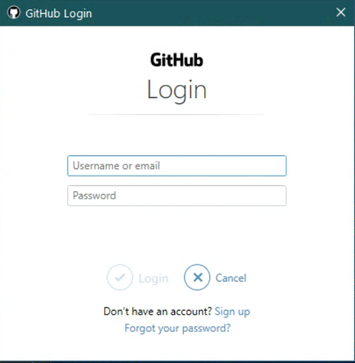
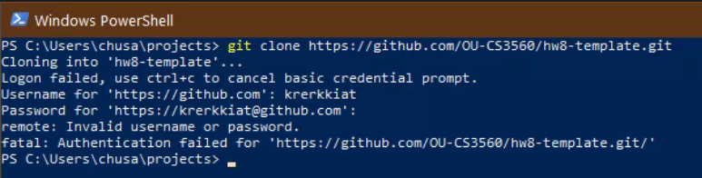

# Git Login Fail

## Symptoms

When attempt to clone, a window (see image below) will reject all the
combinations of username/email and password/token.



Git will tell you

```console
Login failed, use ctrl+c to cancel basic credential prompt.
```

and prompt you for credential again in the command line.



## How to solve it

We will solve this by adding the token manually with
`git credential-manager store`. Run the command and type in
the following (there will be no prompt).

```plain
protocol=https
host=github.com
username=your-username
password=your-token
```

Make sure to replace `your-username` with your actual username, and
replace `your-token` with your actual token.

Then hit enter twice after you type in the last line. Your username
and token should now be saved and git command should not
ask for username and password anymore.

## Why it fails?

Somehow GCM (Git Credential Manager for Windows), receive 404
response code from GitHub when it try to ask if the token is valid.

Resources used
- `GIT_TRACE` and `GCM_TRACE`
- https://mirrors.edge.kernel.org/pub/software/scm/git/docs/git-credential.html for the format
- https://github.com/microsoft/Git-Credential-Manager-for-Windows/blob/master/Cli/Manager/Program.cs for `git credentail-manager store`
- https://github.com/Microsoft/Git-Credential-Manager-for-Windows/issues/435 for similar issue
